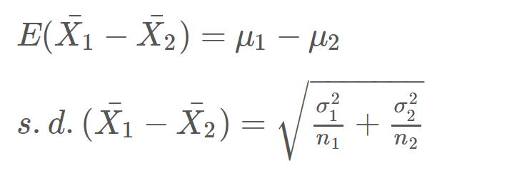
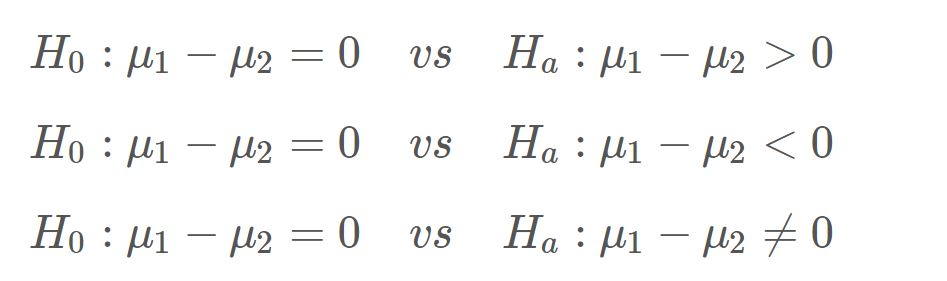
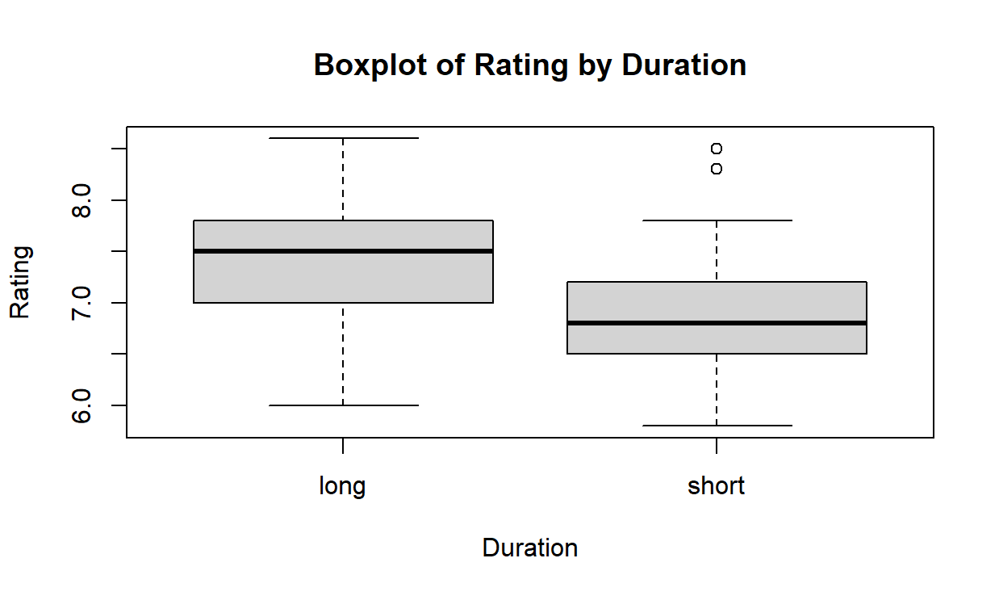
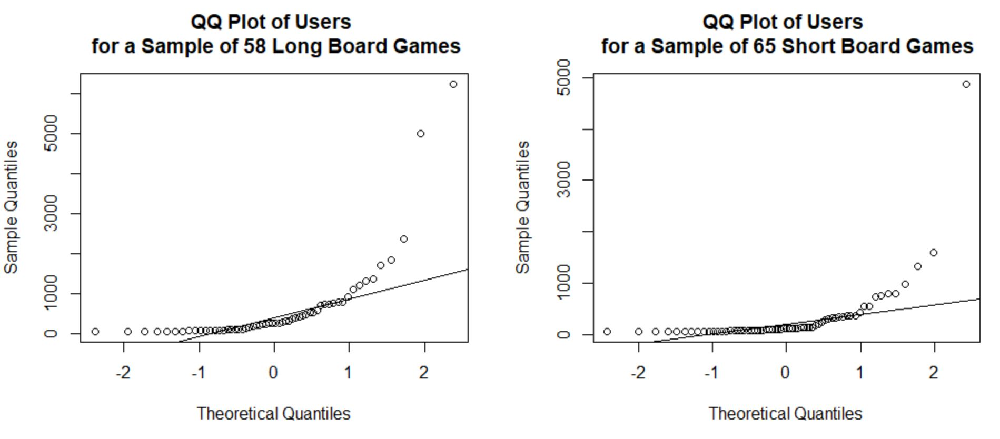

```{r setup, include = FALSE}
knitr::opts_chunk$set(echo = TRUE)
```


## Learning Objectives

### Statistical Learning Objectives
1. Master the sampling distribution of the difference in two sample means
1. Carry out a hypothesis test for a difference in two population means

### R Learning Objectives
1. Learn how to subset (or filter) data
1. Compute numerical summaries
1. Run a t-test for a difference in two population means

### Functions and Syntax
1. `subset()`
1. `unique()`
1. `qqnorm()`
1. `qqline()`
1. `boxplot()`
1. `t.test()`
1. `twoPopPropHT()`


***


## Lab Tutorial

### Sampling Distribution of Xbar1 - Xbar2

As we have seen many times this semester, the value of a statistic will vary from random sample to random sample. This week, our *statistic* is now a **difference in sample means** (or Xbar1 - Xbar2) and this will also vary from sample to sample. Because of this, we can create a sampling distribution for the difference in two (independent) sample means. We can quantify aspects of this sampling distribution, such as the center and spread. 

{width=300px}

We can use the above properties for *any* sample size! 

What can we say about the shape of this sampling distribution? With the sampling distribution for the difference in two sample means:

If both of the populations are normally distributed (or both of the sample sizes are large enough to use the CLT), then the sampling distribution for Xbar1 - Xbar2 is (approximately) normal.


### Comparing Groups Graphically 

Remember our `penguins` data set from the first few labs? We're going to use this data again today. But instead of the entire data set, we are going to focus on the Gentoo species - using a data set called `gentoo`.

```{r readGentoo}
gentoo <- read.csv("gentoo.csv")
```

A reminder of its contents.

```{r PreviewGentoo}
head(gentoo)
```

In today's lab, we will be comparing different measurements of the penguins by sex (female vs male). 

As always, we will start by graphically comparing the two groups before performing any inference procedure.  To compare two groups graphically, we can create a side-by-side boxplot using the `boxplot()` function that we learned about in the Lab 3.  Let's create a side-by-side boxplot to compare the body mass for female versus male penguins. 

```{r sideBysideBoxplot}
boxplot(gentoo$body_mass_g ~ gentoo$sex,
        xlab = "Sex",
        ylab = "Body Mass (in grams)",
        main = "Boxplot of Body Mass by Sex")
```

**Question:** In general, which sex has heavier body mass? 

**Answer:**

**Demo #1:** Create a side-by-side boxplot to compare the flipper length for female versus male penguins. 

```{r demo1, error = T}
# Replace this text with your code

```  

**Question:** How do the means compare across the two groups?

**Answer:**


### Subsetting Data

You may recall the `aggregate()` function (from Lab 3) which allows us to calculate numerical summaries by group. Unfortunately, we can't use this function with plots. Instead, we must split our main data set into two smaller data sets - and then plot the data of each. This process will come in handy for checking the normality of each sample. 

The `subset()` function filters a data set based on a logical expression.

In order to check for normality, we need to create one data set of only female Gentoo penguins and one data set of only male Gentoo penguins. To create the data set of only female Gentoo penguins, we would use the following code.

```{r subsetFemale}
female <- subset(gentoo, sex == "female")
```

There are two things that you should note here:

1. We stored the results as a new data set named `female` 
2. We must use a double equals sign (==) in the logical expression  

We could use other logical expressions, but we will mainly be filtering the data based on a specific category or group. This is the only time we will need to use a double equals sign. 

We can use the `head()` function to check that the first few rows of our new data set contain only female Gentoo penguins. 

```{r subsetCheck}
head(female)
```

Perfect!

Note: the `subset()` function is very picky about spelling and capitalization. If we would have used an uppercase "F", the above `subset()` function would not have worked properly. To make sure that we have the spelling and capitalization correct, we can utilize the `unique()` function. This function outputs the groups of a categorical variable. 

```{r categories}
unique(gentoo$sex)
```

We have "female" (with a lowercase "f") and "male" (with a lowercase "m"). So be careful with the `subset()` function - and if you don't get the results you expect, double check your spelling. 

Your turn to subset some data!

**Demo #2:** Create a new data frame called `male` that includes only male Gentoo penguins. Hint: remember the double equals sign! 

```{r demo2, error = T}
# Replace this text with your code

```  

**Question:**  How many observations does your new data set include? Take a look in the top right window. 

**Answer:**


### Checking for Normality 

For the normality assumption regarding a difference in two population means, we have to create *two* histograms or *two* QQ plots - one for each sample of data. In the previous section, we learned how to subset the data to get these two independent samples of data.

Now that the data is split up by `sex`, we can create a QQ plot (or histogram) for *each* of the samples. Let's start with the female subset.

```{r qqplotFemale}
qqnorm(female$body_mass_g, main = "QQ Plot of Body Masses - Female")
qqline(female$body_mass_g)
```

**Question: **Is it reasonable for us to assume that this sample of *female* body masses was drawn from a normally distributed population? Why or why not? 

**Answer:** 


What about the male body masses? 

**Demo #3:** Create the QQ plot for the `male` subset (that you created in Demo #1). 

```{r demo3, error = T}
# Replace this text with your code

```

**Question:**  Is it reasonable for us to assume that this sample of *male* body masses was drawn from a normally distributed population? Why or why not? 

**Answer:**


### The t-Distribution

If we have determined that the sampling distribution of Xbar1 - Xbar2 is normal or approximately normal, we can proceed with our statistical analysis using the t-distribution. With a difference in two population means, we will use the degrees of freedom from technology (Welch approximation) or, if technology is not available, use the conservative estimate of df = min(n1 - 1, n2 - 1).


### Hypothesis Testing

A hypothesis test helps us judge whether or not a statement about a population is reasonable or not. The procedure for running any hypothesis test involves three steps:

1. Stating two competing hypotheses about an unknown parameter
2. Analyzing the evidence collected from sample data
3. Making a decision about whether or not the sample data supports the new theory

Our parameter of interest is now the difference in two population means, mu1 - mu2. When setting up the hypotheses, we have three options.

{width=400px}

Suppose we wish to assess if there is a *difference* in the population mean body mass of all female Gentoo penguins and the population mean body mass of all male Gentoo penguins.

**Question:** State the null hypothesis and alternative hypothesis

**Answer:**


No that you have stated the hypotheses, let's run the test. To do so, we will once again utilize the `t.test()` function. 

```{r HTtwoMeans}
t.test(gentoo$body_mass_g ~ gentoo$sex,
       mu = 0,
       alternative = "two.sided")
```

We now have four arguments to worry about:

- Variables: **quantitative by categorical**
- `mu`: hypothesized value of mu1 - mu2 (typically 0)
- `alternative`: alternative hypothesis ("less", "greater", or "two.sided")

**Question:** How much evidence against the null (H0) and in support of the alternative (Ha) do we have? 

**Answer:** 


Suppose we wish to *assess* if there is a *difference* in the population mean flipper length of all female Gentoo penguins and the population mean flipper length of all male Gentoo penguins. 

**Question:** State the null and the alternative hypotheses

**Answer:** 

**Demo #4:**  Using the `t.test()` function, run the appropriate hypothesis test. 

```{r demo4, error = T}
# Replace this text with your code

```

**Question:**  How much evidence do you have against the null (and in support of the alternative)? What would your conclusion be?

**Answer:**


### Two Population Proportions (Optional)

If you wish to run a *hypothesis test* for the difference in two population proportions, you can utilize the following user-created function. Simply run the code chunk to load the function. Then, check out the example below to see how it works!

```{r twoPopPropHTfunction, echo = FALSE}

twoPopPropHT <- function(x1, n1, x2, n2, alternative = "two.sided"){
  
  # Calculates the sample proportions 
  phat1 <- x1 / n1
  phat2 <- x2 / n2
  
  # Calculates the estimate of the common population proportion
  phat <- ((n1 * phat1) + (n2 * phat2)) / (n1 + n2)
  
  # Calculates the null standard error
  null.se <- sqrt((phat * (1 - phat)) * ((1 / n1) + (1 / n2)))
  
  # Calculates the z test statistic
  z.test.stat <- (phat1 - phat2) / null.se
  
  # Calculates the p-value (based on the alternative hypothesis provided - default is two-sided)
  if (alternative == "greater") {p.value <- pnorm(z.test.stat, lower.tail = FALSE)
  } else if (alternative == "less") {p.value <- pnorm(z.test.stat, lower.tail = TRUE)
  } else if (alternative == "two.sided") {p.value <- 2 * pnorm(abs(z.test.stat), lower.tail = FALSE)
  }
  
  # Returns list of helpful values
  return(list("phat1" = phat1, "phat2" = phat2, 
              "z.test.stat" = z.test.stat, "p.value" = p.value))
}
```

The `twoPopPropHT()` function has five arguments:

1. `x1`: number of "successes" for group 1
2. `n1`: sample size of group 1
3. `x2`: number of "successes" for group 2
4. `n2`: sample size of group 2
5. `alternative`: alternative hypothesis ("less", "greater", or "two.sided") 

Example: Two popular grocery chains (Meijer and Kroger) offer rewards programs. A marketing firm wishes to estimate the difference in the rates of rewards members at both stores. They find that *180 out of 200* randomly selected Kroger customers (Group 1) and *80 out of 100* randomly selected Meijer customers (Group 2) are enrolled in their respective rewards programs. Assess if there is a difference in rewards rates. 

```{r twoPopPropHTexample}
twoPopPropHT(x1 = 180, n1 = 200, x2 = 80, n2 = 100, alternative = "two.sided")
```


***


## Try It!

Complete the following exercises. Remember, the "Try It" questions will typically be code-based and will be graded for **completeness**. Be sure to give *every* question your best shot! We strongly encourage you to form small groups and work together.

In this Try It, you will be creating all of the R output needed for your second project. This assignment focuses around the show Shark Tank. If you would like to read more about the prompt, you can find it on Canvas. 


**Data Set**

This data set contains data from 495 randomly selected entrepreneurs/products that were on Shark Tank. The variables in the data set are:

- `deal`: whether or not a deal was made with a Shark (yes or no)
- `entrepreneurs`: number of entrepreneurs presenting the idea (single or multiple)
- `season`: when the idea was presented (early (seasons 1-3) or late (seasons 4-6))
- `type`: category of the idea presented (leisure or necessity)
- `amount`: requested funding from the entrepreneur(s) (in thousands of dollars)
- `equity`: percent of the business the entrepreneur(s) will give in exchange for funding
- `valuation`: believed company worth according to the entrepreneur(s) (in millions of dollars)

**Questions of Interest**

1. On average, is there a difference between funding requested by entrepreneurs who land a deal with a Shark versus those who do not land a deal with a Shark?
2. On average, is there a difference in equity in exchange for funding between teams with multiple entrepreneurs compared to single entreprenuers?
3. On average, is there a difference in equity in exchanged for funding between entrepreneurs in earlier seasons compared to later seasons?
4. On average, is there a difference in valuation between entrepreneurs in early seasons compared to later seasons?
5. What type of product is more likely to land a deal with a Shark?
6. Are sharks making more deals in later seasons compared to earlier seasons of the show?


This is another "choose your own adventure" lab. So if you get stuck or run into any problems, please let your GSI know!

> **1.** Start by reading in the data by running the code chunk below. Note: you do not have to report anything for an answer.

```{r reaSharkTank}
sharktank <- read.csv("SharkTank.csv")
```


> **2.** Select one of the questions (1 - 6) listed above to analyze over the next few questions. Copy and paste the full question below.

**Answer:** 


> **3.** Is your question (from Try It 2) analyzing a difference in two means or a difference in two proportions? Think about the variable types posed in your question.

**Answer:** 


> **4.** Create a side-by-side boxplot or two-way frequency table to help answer the question you chose in Try It 2. Note: Questions 1 - 4 require a side-by-side boxplot and Questions 5 - 6 require a two-way table.  

```{r tryIt4, error = T}
# Replace this text with your code

```


> **5.** Run a hypothesis test to help answer the question you chose in Try It 2. Note: Questions 1 - 4 require the `t.test()` function covered in today's lab tutorial and Questions 5 - 6 require the `twoPopPropHT()` function (see the optional Two Population Proportions section in the Lab Tutorial - just above the Try It section). Ask your GSI if you need help!

```{r tryIt5, error = T}
# Replace this text with your code

```


> **6.** Select one of the questions (1 - 6) listed above to analyze over the next few questions. Copy and paste the full question below.

**Answer:**


> **7.** Is your question (from Try It 6) analyzing a difference in two means or a difference in two proportions? Think about the variable types posed in your question.

**Answer:** 


> **8.** Create a side-by-side boxplot or two-way frequency table to help answer the question you chose in Try It 6. Note: Questions 1 - 4 require a side-by-side boxplot and Questions 5 - 6 require a two-way table.   

```{r tryIt8, error = T}
# Replace this text with your code

```


> **9.** Run a hypothesis test to help answer the question you chose in Try It 6. Note: Questions 1 - 4 require the `t.test()` function covered in today's lab tutorial and Questions 5 - 6 require the `twoPopPropHT()` function (see the optional Two Population Proportions section in the Lab Tutorial - just above the Try It section). Ask your GSI if you need help!

```{r tryIt9, error = T}
# Replace this text with your code

```


***


## Dive Deeper

Complete the following questions. Remember, the "Dive Deeper" questions will involve analyzing the results and will be graded for **correctness**. If you have any questions, please ask for help (in lab, in office hours, or on Piazza)!

The following two questions involve a separate analysis centered around a data set called `boardgames`. With this data set, we are interested in comparing board games grouped by duration - short vs long. You are welcome to explore the data set below, but it is not necessary to complete the two Dive Deeper questions. 


> **1.** We wish to compare the average rating between short and long board games. Assuming the normality assumption (for each group) is met, you look to perform a hypothesis test for a difference in two population means. You would like to assess if all long board games have **lower** rating, on average, compared to all short board games.   You are provided with the graph below. It is suggested that the resulting p-value is very large, larger than 0.50.  Would you agree with this suggested p-value?  Explain why or why not. 



**Answer:** Replace this text with your answer.


> **2.** We also wish to compare the average popularity between short and long board games (by using the variable `users`). The following QQ plots were generated and these suggest that the two samples were *not* drawn from normally distributed populations. Would we still be able to run the desired two-sample t-test? Why or why not? 



**Answer:** Replace this text with your answer.


***


## Submission Instructions

Carefully follow the instructions below to submit your work.

1. At the top of this document, change the `author` field to your name (in quotes!). 

2. Click the **Knit** button one last time.

3.  In the Files pane (the bottom right window), check the box next to "lab07report.html".

4. Click More > Export... 

5. Leave the name of the file as "lab07report.html". **Do not change the file name.** Click Download and save the file to your computer.  

6.  On the Stats 250 Canvas site, click the "Assignments" panel on the left side of the page. Scroll to find "Lab 7", and open the assignment. Click "Start Assignment". 

7.  At the bottom of the page, upload your saved "lab07report.html" file. 

8.  Click "Submit Assignment". 


